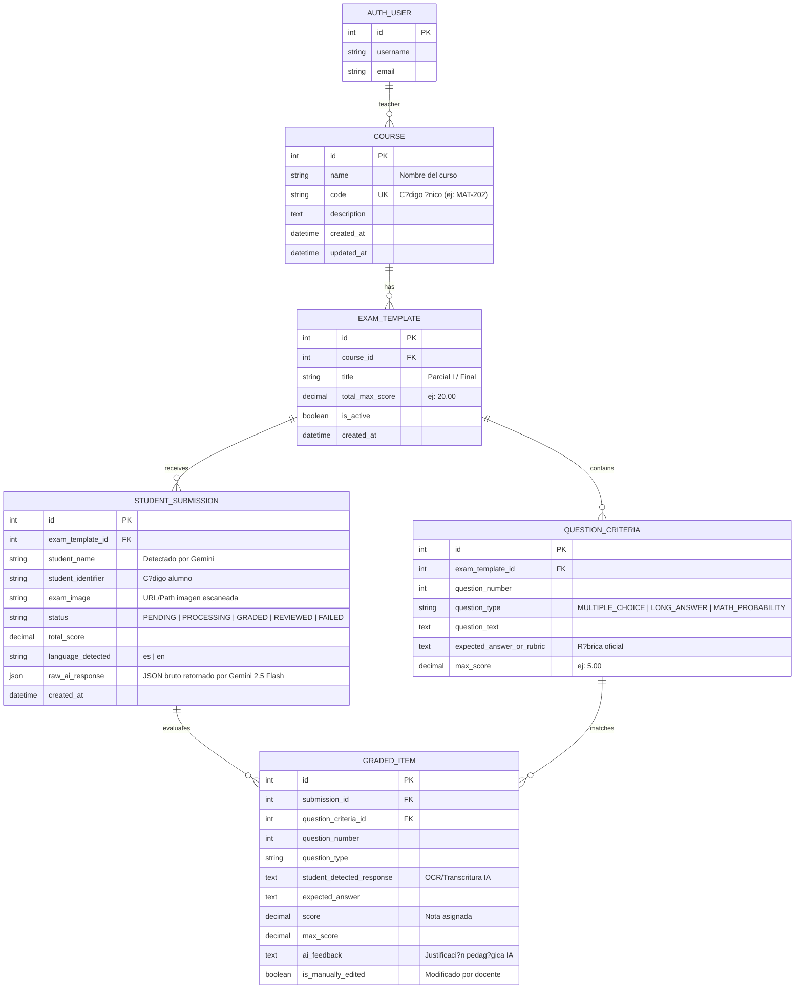

# Modelo de Datos y Entidades Relacionales (EduGrade AI)

Este documento detalla el esquema relacional de la base de datos PostgreSQL de **EduGrade AI**, las entidades principales, sus relaciones y la estructura de los campos `JSONField`.

---

## 1. Diagrama Entidad-Relaci?n (Mermaid ER)



---

## 2. Descripci?n de Entidades

### `Course` (Curso o Asignatura)
- Agrupa ex?menes y est? asignado a un docente (`auth.User`).
- C?digo ?nico indexado para b?squedas r?pidas.

### `ExamTemplate` (Plantilla de Examen)
- Define la cabecera y puntaje m?ximo del examen (ej. 20 puntos).
- Act?a como contenedor de las preguntas y r?bricas.

### `QuestionCriteria` (R?brica por Pregunta)
- Almacena el enunciado, tipo (`MULTIPLE_CHOICE`, `LONG_ANSWER`, `MATH_PROBABILITY`), puntaje individual y la respuesta esperada detallada que servir? de *ground truth* para el modelo Gemini 2.5 Flash.

### `StudentSubmission` (Entrega Escaneada)
- Representa el examen f?sico capturado por la app m?vil en Flutter o subido v?a web.
- Almacena la imagen escaneada, el estado del ciclo de vida (`PENDING` ? `PROCESSING` ? `GRADED` ? `REVIEWED`), el puntaje total consolidado y la respuesta cruda de la IA.

### `GradedItem` (Calificaci?n Desglosada por Pregunta)
- Desglosa la evaluaci?n de cada pregunta: transcripci?n de la respuesta del alumno, comparaci?n con la r?brica, puntaje asignado, justificaci?n y un flag `is_manually_edited` para auditor?a cuando el docente modifica una nota manualmente desde el Dashboard.

---

## 3. Estructura de `raw_ai_response` (`JSONField`)

El campo `StudentSubmission.raw_ai_response` almacena la respuesta multimodal estructurada generada por Gemini 2.5 Flash con el siguiente esquema:

```json
{
  "student_name": "Carlos Mendoza",
  "student_identifier": "20210458",
  "language_detected": "es",
  "total_score": 18.5,
  "answers_evaluated": [
    {
      "question_number": 1,
      "question_type": "MULTIPLE_CHOICE",
      "student_detected_response": "Alternativa C seleccionada",
      "expected_answer": "C",
      "score": 4.0,
      "max_score": 4.0,
      "ai_feedback": "Correcto. El alumno identific? la propiedad asociativa correctamente."
    },
    {
      "question_number": 2,
      "question_type": "LONG_ANSWER",
      "student_detected_response": "Explica que la mitocondria produce ATP mediante la cadena de transporte de electrones.",
      "expected_answer": "Debe mencionar s?ntesis de ATP, respiraci?n celular y membrana interna.",
      "score": 5.5,
      "max_score": 6.0,
      "ai_feedback": "Respuesta muy completa. Falt? mencionar la matriz mitocondrial para puntaje perfecto."
    }
  ]
}
```
